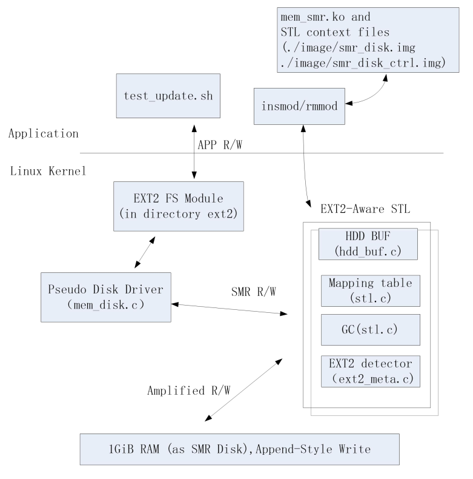

# MEM_SMR
MEM_SMR: A Linux Kernel module for simulating Shingled Magnetic Recording, with EXT2-file-system-aware ability

| Overview |
|:-------------:|
|  |

## How to build 

```sh
iron@CSE:github$ pwd
/home/iron/github

iron@CSE:github$ git clone https://github.com/sheisc/mem_smr.git

iron@CSE:github$ cd mem_smr

iron@CSE:mem_smr$ make
```

## How to use

```sh
iron@CSE:mem_smr$ sudo ./load.sh 
load mem_smr kernel module, please wait ........
make ext2 file system on /dev/mem_disk
mke2fs 1.44.1 (24-Mar-2018)

Warning: the fs_type ext2 is not defined in mke2fs.conf

Creating filesystem with 262144 4k blocks and 65536 inodes
Filesystem UUID: 2f7b5169-20a0-4b23-9f84-35644107dc34
Superblock backups stored on blocks: 
	32768, 98304, 163840, 229376

Allocating group tables: done                            
Writing inode tables: done                            
Writing superblocks and filesystem accounting information: done
```

We have mounted /dev/mem_disk to ~/github/mem_smr/mnt.

## How to unmount

```sh
iron@CSE:mem_smr$ sudo ./unload.sh 
umount ./mnt, please wait ........
remove kernel module, please wait ........
```

## dmesg

```sh
iron@CSE:mem_smr$ dmesg

[ 2621.390978] iron5:--------------------mem_disk_init() begins:------------------------
[ 2621.390980] iron5:aware = 1 favor = 1
[ 2621.411994] iron5:load_system_data(): IS_ERR(disk_fp) || IS_ERR(disk_fp)
[ 2621.411995] iron5:load_system_data() < 0 
[ 2621.413972] iron5:int init_smr_disk(void) 
[ 2621.413973] iron5:mem_disk_init() ends. disk_size:40000000
[ 2621.432074] iron5:illegal magic number 0x0
[ 2621.436318] iron5:meta_ctr.status = SB0_DETECTED; 
[ 2621.436320] iron5:gd_cnt = 8 
[ 2621.436323] iron5:meta_ctr.status = SBs_DETECTED; 
[ 2621.436450] iron5:meta_ctr.status = BG_DESCs_DETECTED; 
[ 2621.436451] iron5:meta_ctr.status = BLK_BITMAP_DETECTED; 
[ 2621.436452] iron5:meta_ctr.status = INO_BITMAP_DETECTED; 
[ 2621.436577] iron5:meta_ctr.status = EXT2_DETECTED; 
[ 2621.436787] iron5:mark_one_blk_bmp(from = 0x0): count = 0x7eb7 
[ 2621.436788] iron5:free count = 0x7eb7 , BG#0x0, at block 0x41
[ 2621.437006] iron5:mark_one_blk_bmp(from = 0x8000): count = 0x7ebd 
[ 2621.437006] iron5:free count = 0x7ebd , BG#0x1, at block 0x8041
[ 2621.437211] iron5:mark_one_blk_bmp(from = 0x10000): count = 0x7efe 
[ 2621.437212] iron5:free count = 0x7efe , BG#0x2, at block 0x10000
[ 2621.437438] iron5:mark_one_blk_bmp(from = 0x18000): count = 0x7ebd 
[ 2621.437438] iron5:free count = 0x7ebd , BG#0x3, at block 0x18041
[ 2621.437643] iron5:mark_one_blk_bmp(from = 0x20000): count = 0x7efe 
[ 2621.437644] iron5:free count = 0x7efe , BG#0x4, at block 0x20000
[ 2621.437852] iron5:mark_one_blk_bmp(from = 0x28000): count = 0x7ebd 
[ 2621.437853] iron5:free count = 0x7ebd , BG#0x5, at block 0x28041
[ 2621.438060] iron5:mark_one_blk_bmp(from = 0x30000): count = 0x7efe 
[ 2621.438061] iron5:free count = 0x7efe , BG#0x6, at block 0x30000
[ 2621.438271] iron5:mark_one_blk_bmp(from = 0x38000): count = 0x7ebd 
[ 2621.438272] iron5:free count = 0x7ebd , BG#0x7, at block 0x38041
[ 2621.438272] iron5:mark_all_free_blks(void): total free : 0x3f6a5
[ 2621.445730] EXT4-fs (mem_disk): mounting ext2 file system using the ext4 subsystem
[ 2621.445930] iron5:EXT2_DETECTED: hit super block #0 
[ 2621.446102] EXT4-fs (mem_disk): mounted filesystem without journal. Opts: (null)
[ 2706.676851] iron5:hit block bitmap: 0x41 
[ 2706.677485] iron5:EXT2_DETECTED: hit super block #0 
[ 3018.488586] iron5:EXT2_DETECTED: hit super block #0 
[ 3018.536497] iron5:SMR: write(2309),read(263)
[ 3018.536498] iron5:HDD: write(2297),read(276)
[ 3018.536499] iron5:BUF: write(12),read(0)
[ 3018.536499] iron5:Amplified write_read(2322) : SMR write(2309)
[ 3018.536500] iron5:BUF hit count = 6
[ 3018.536530] iron5:int release_smr_disk(void) 
[ 3018.536531] iron5:mem_disk_exit() 
```

## Please refer to document.pdf for more details